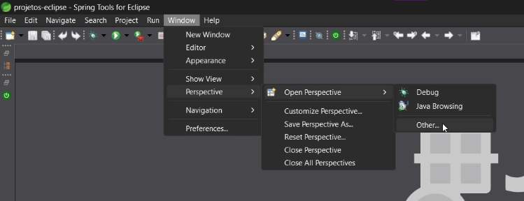
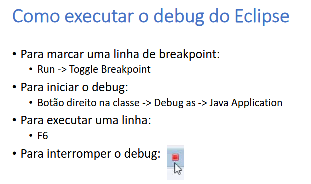

# Eclipse IDE

## Atalhos

- ctrl + shift + o → importa todos os pacotes necessários
- alt + shift + r → renomear
- ctrl + shift + c → comentar bloco de código selecionado
- ctrl + shift + f → identar o código

---

## Ajeitar layout

---

## Alterar JDK utilizado pelo eclipse

- Window → Preferences… → installed JREs → add → Standard VM → escolher diretório que contém o JDK desejado

---

## Criar novo projeto Java

- File → New → Java Project
- Nome do projeto de preferência deve ser sem espaços e sem acentuação
- Por enquanto, desativar módulo

## Debug

## Gerar construtores, getters e setters automaticamente

- Botão direito -> Source -> Generate Constructor using Fields
- Botão direito -> Source -> Generate Getters and Setters