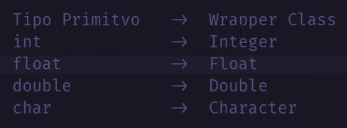

# Arrays e ArrayLists em Java

## 1. Array (Vetor Estático)
É uma coleção de dados alocada de forma eficiente na memória.
* **Complexidade:** O(1) para acesso direto aos elementos.
* **Características:** Possui **tamanho fixo** (definido no momento da criação) e armazena elementos estritamente do mesmo tipo.

### Sintaxe e Exemplos
```java
// Formas gerais de declaração e inicialização
int[] numeros1 = {1, 2, 3};
int numeros2[] = {1, 2, 3};

// Declaração reservando o espaço com tamanho fixo
int[] numeros3 = new int[3];

// Atribuindo elementos ao array
numeros3[0] = 1;
numeros3[1] = 2;
numeros3[2] = 3; 

// Para saber o tamanho do array (propriedade length)
int tamanho = numeros1.length;

// Para acessar um dado elemento do array pelo índice
int primeiro_elemento = numeros1[0];
```

## 2. ArrayList (Vetor Dinâmico)
É uma coleção de dados com **tamanho dinâmico**, permitindo redimensionamento automático conforme elementos são adicionados ou removidos.

### Considerações Importantes
* `ArrayList` é uma classe pronta do Java (`java.util.ArrayList`). Portanto, suas operações são executadas via métodos.
* Os dados armazenados internamente são do tipo `Object`. **Não é possível passar tipos primitivos** diretamente para um ArrayList; é obrigatório o uso de **Wrapper Classes** (ex: `Integer`, `Double`).



* **Mecanismo de Redimensionamento:** Um ArrayList é criado com um tamanho padrão de **10 posições**. Ao tentar adicionar o 11º elemento, ele dobra sua capacidade para 20 posições (e o mesmo processo se repete sempre que a capacidade máxima é atingida). O redimensionamento tem um custo de desempenho, pois exige alocar um novo array maior e copiar todos os elementos anteriores.

### Complexidade das Operações
* **Adição (no final):** O(1) (exceto quando ocorre o redimensionamento).
* **Acesso e Atualização:** O(1).
* **Inserção e Remoção:** O(N), já que os elementos precisam ser deslocados para manter a integridade da sequência.

### Métodos e Sintaxe Básica
```java
import java.util.ArrayList;

// Declaração e instanciação
ArrayList<String> arrayDinamico = new ArrayList<String>();

// Adicionar elementos no final do ArrayList
arrayDinamico.add("String1");
arrayDinamico.add("String2");

// Descobrir o tamanho atual
int tamanho = arrayDinamico.size();

// Acessar um dado elemento pelo índice
String elemento_x = arrayDinamico.get(x); 

// Remover um elemento pelo índice
arrayDinamico.remove(x);

// Limpar todos os elementos da estrutura
arrayDinamico.clear();
```

## 3. Ordenação de ArrayLists
A ordenação de elementos em um ArrayList é feita utilizando a classe utilitária `Collections`.

```java
import java.util.ArrayList;
import java.util.Collections;

ArrayList<Integer> numeros = new ArrayList<Integer>();
numeros.add(5);
numeros.add(3);
numeros.add(7);
numeros.add(2);

// Ordena o ArrayList em ordem crescente
Collections.sort(numeros); 

// Ordena o ArrayList em ordem decrescente
Collections.sort(numeros, Collections.reverseOrder());
```